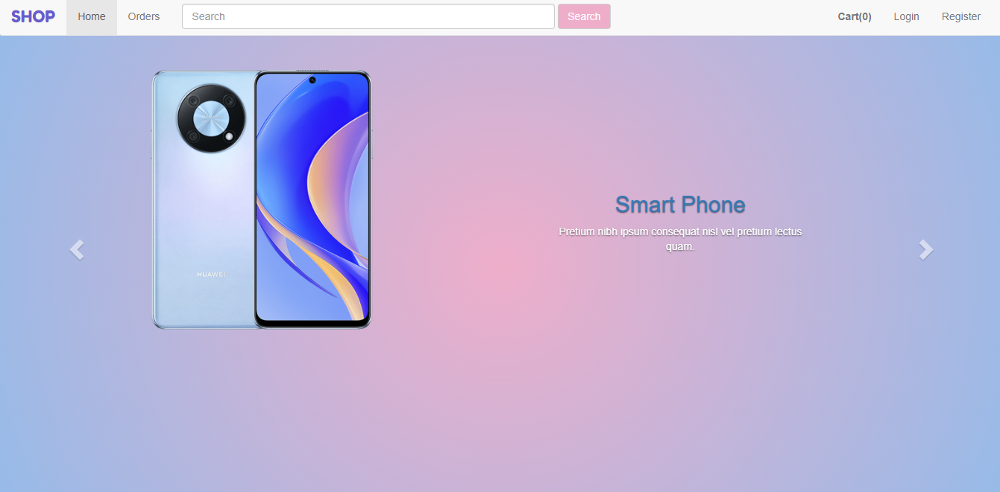

<h1 align="center"> E-commerce Website with Laravel</h1>

### I used Laravel framework in the back-end of this web application.Laravel framework uses php language and mysql database. I also used bootstrap and css for design. 

<h4>PS: However, there are still bugs to fix and lot of components to add.
I will keep contributing. ☻</h4>

### Homepage

### Trending Items

### Login and Register Pages

### Search Results

### Shopping Cart

### Order and Checkout

### Footer

